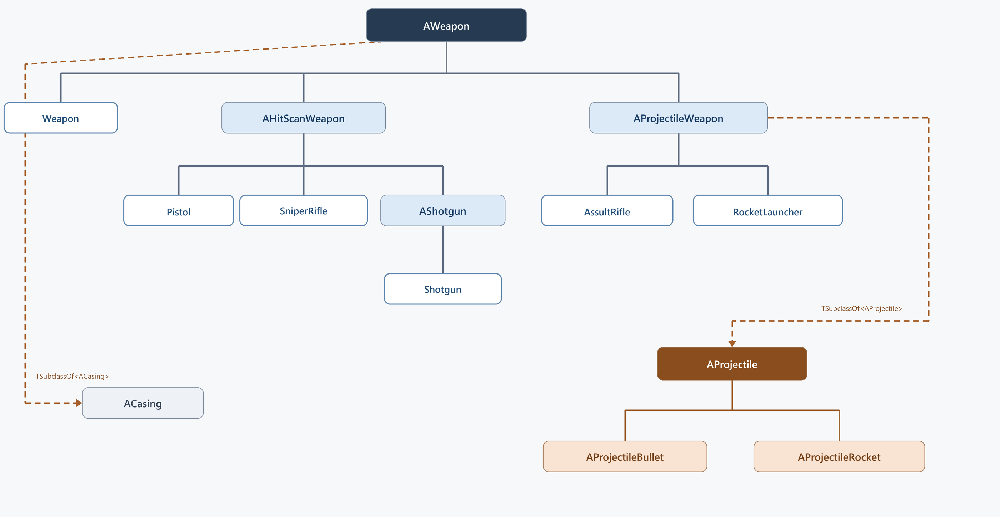

# 武器分类、弹体与弹药数据

## 功能点介绍

项目使用少量 C++ 基类承载通用机制，再通过编辑器资产配置出不同枪械。Content Browser 中能够看到六个武器资产，但它们并不对应六个不同的 C++ 武器类，也不代表六种 `EWeaponType`。

六个资产在 C++ 层实际归入四种结构：

```text
通用 Weapon 配置                  → AWeapon
手枪、狙击步枪                    → AHitScanWeapon
突击步枪、火箭发射器              → AProjectileWeapon
霰弹枪                            → AShotgun
```

其中通用 Weapon 配置是 `AWeapon` 的直接资产配置，使用突击步枪外观，但没有形成新的武器枚举。其余五个具体枪械配置才与 `EWeaponType` 中的五种武器身份对应。

本单元只介绍武器类别、C++ 继承关系、弹体类、弹壳类与弹药数据，不展开开火、瞄准、换弹等操作流程。

## C++ 类关系图



图中填充颜色的节点使用真实 C++ 类名；白色蓝边的末端节点表示六个编辑器武器配置，并按要求省略资产前缀：

```text
Weapon
AssultRifle
Pistol
RocketLauncher
Shotgun
SniperRifle
```

连接 C++ 类的实线表示 C++ 继承，连接白色末端节点的实线表示该编辑器配置的 Parent Class。虚线表示成员类型或组件引用：

- `AHitScanWeapon`、`AProjectileWeapon` 继承 `AWeapon`。
- `AShotgun` 继承 `AHitScanWeapon`。
- `AProjectileBullet`、`AProjectileRocket` 继承 `AProjectile`。
- `AProjectileWeapon` 通过 `TSubclassOf<AProjectile>` 关联弹体类，不继承弹体。
- `AWeapon` 通过 `TSubclassOf<ACasing>` 关联弹壳类。

## 三个相互独立的分类维度

### 1. C++ 机制类

C++ 类决定武器具备哪一组机制数据：

| C++ 类 | 父类 | 主要职责 |
| --- | --- | --- |
| `AWeapon` | `AActor` | 公共网格体、状态、武器规格、弹药与表现资源 |
| `AHitScanWeapon` | `AWeapon` | 射线类武器专用的光束、命中特效和声音资源 |
| `AProjectileWeapon` | `AWeapon` | 保存普通弹体类与服务器倒带弹体类 |
| `AShotgun` | `AHitScanWeapon` | 在射线基础上增加多弹丸数量和聚合数据 |

相关实现：

- `Source/Blaster/Weapon/Weapon.h:32`
- `Source/Blaster/Weapon/HitScanWeapon.h:11`
- `Source/Blaster/Weapon/ProjectileWeapon.h:13`
- `Source/Blaster/Weapon/Shotgun.h:11`

### 2. EWeaponType：武器身份

`EWeaponType` 回答“这把枪在游戏规则中是什么武器”：

| 枚举 | 武器身份 |
| --- | --- |
| `EWT_AssaultRifle` | 突击步枪 |
| `EWT_RocketLauncher` | 火箭发射器 |
| `EWT_Shotgun` | 霰弹枪 |
| `EWT_SniperRifle` | 狙击步枪 |
| `EWT_Pistol` | 手枪 |

项目当前只有这五种武器身份。Content Browser 中额外出现的通用 Weapon 配置不是第六个 `EWeaponType`。

相关实现：

- `Source/Blaster/Weapon/WeaponTypes.h:10`

### 3. EFireType：命中机制

`EFireType` 回答“这把武器采用什么技术机制”：

| 枚举 | 机制 | 对应 C++ 类 |
| --- | --- | --- |
| `EFT_HitScan` | 单射线 | `AHitScanWeapon` |
| `EFT_Projectile` | 实体投射物 | `AProjectileWeapon` |
| `EFT_Shotgun` | 多弹丸霰弹 | `AShotgun` |

`EWeaponType` 与 `EFireType` 是两条独立分类轴。武器身份不能直接推导命中机制；例如当前突击步枪属于 `EWT_AssaultRifle`，但采用 `EFT_Projectile`，并不是射线武器。

相关实现：

- `Source/Blaster/Weapon/Weapon.h:22`

## 六个武器资产如何映射到 C++

| 编辑器中的配置 | C++ 类型 | 武器身份 | 命中机制 | Skeletal Mesh |
| --- | --- | --- | --- | --- |
| 通用 Weapon | `AWeapon` | 使用默认 Assault Rifle 身份 | 使用默认 Hit Scan 枚举值 | `Assault_Rifle_A` |
| Assault Rifle | `AProjectileWeapon` | `EWT_AssaultRifle` | `EFT_Projectile` | `Assault_Rifle_A` |
| Pistol | `AHitScanWeapon` | `EWT_Pistol` | `EFT_HitScan` | `Pistols_A` |
| Rocket Launcher | `AProjectileWeapon` | `EWT_RocketLauncher` | `EFT_Projectile` | `Rocket_Launcher_A` |
| Shotgun | `AShotgun` | `EWT_Shotgun` | `EFT_Shotgun` | `Shotgun_A` |
| Sniper Rifle | `AHitScanWeapon` | `EWT_SniperRifle` | `EFT_HitScan` | `Sniper_Rifle_A` |

### 通用 Weapon 为什么不算第六种武器

通用 Weapon 直接使用 `AWeapon` 作为父类，并使用 `Assault_Rifle_A` 模型。它没有对应的独立 `EWeaponType`，也没有 `AHitScanWeapon` 的射线资源字段或 `AProjectileWeapon` 的弹体类型字段。

当前 Content 资产引用扫描没有发现地图或其他资产引用该通用配置，因此将它视为基础模板或早期示例资产，比把它描述成第六种正式武器更准确。

### 共享 C++ 类并不代表枪械完全相同

手枪和狙击步枪都继承 `AHitScanWeapon`，但可以分别配置：

- 不同的 `EWeaponType`。
- 不同的骨骼网格体。
- 不同的伤害、爆头伤害和弹匣容量。
- 不同的射速、自动模式和散布参数。
- 不同的准心、音效、粒子和视野规格。

突击步枪和火箭发射器同样共享 `AProjectileWeapon`，但它们引用不同的 `AProjectile` 子类资产，因此能够在复用武器框架的同时使用不同弹体。

## AWeapon 公共数据

### 武器组件

`AWeapon` 为所有枪械提供统一 Actor 结构：

```text
AWeapon
├─ WeaponMesh：骨骼网格体与 Root Component
├─ AreaSphere：地面武器的范围检测组件
└─ PickupWidget：本地拾取提示
```

`WeaponMesh`、范围组件、提示组件、复制设置和武器状态都由基础类统一管理，具体枪械不需要重复创建这些组件。

### 规格与表现字段

| 数据组 | 字段示例 |
| --- | --- |
| 身份与机制 | `WeaponType`、`FireType` |
| 伤害 | `Damage`、`HeadShotDamage` |
| 弹药 | `Ammo`、`MagCapacity` |
| 时间规格 | `FireDelay`、`bAutomatic` |
| 散布规格 | `bUseScatter`、`DistanceToSphere`、`SphereRadius` |
| 视野规格 | `ZoomedFOV`、`ZoomInterpSpeed` |
| 网络规格 | `bUseServerSideRewind` |
| UI 表现 | 五张准心纹理 |
| 资产表现 | `WeaponMesh`、`EquipSound`、`FireAnimation`、`CasingClass` |

这些字段属于武器的数据定义。本单元不展开消费这些字段的具体操作流程。

相关实现：

- `Source/Blaster/Weapon/Weapon.h:47`
- `Source/Blaster/Weapon/Weapon.h:72`
- `Source/Blaster/Weapon/Weapon.h:81`
- `Source/Blaster/Weapon/Weapon.h:97`
- `Source/Blaster/Weapon/Weapon.h:100`
- `Source/Blaster/Weapon/Weapon.h:113`
- `Source/Blaster/Weapon/Weapon.h:168`

### 武器生命周期状态

`EWeaponState` 与武器类型无关，只描述同一把 Weapon Actor 当前所处的状态：

```text
EWS_Initial
EWS_Equipped
EWS_EquippedSecondary
EWS_Dropped
```

状态变化只影响武器的场景存在方式、碰撞、物理和附加表现，不会改变其 `EWeaponType` 或 `EFireType`。

相关实现：

- `Source/Blaster/Weapon/Weapon.h:11`

## 射线与霰弹类

### AHitScanWeapon

`AHitScanWeapon` 在 `AWeapon` 基础上增加以下射线类专用资源：

- `ImpactParticles`
- `HitSound`
- `BeamParticles`
- `MuzzleFlash`
- `FireSound`

这些字段由手枪和狙击步枪共同复用。二者不需要建立独立的 C++ 手枪类或狙击枪类，差异由武器身份和资产数据表达。

### AShotgun

`AShotgun` 继续继承 `AHitScanWeapon`，并增加 `NumberOfPellets`，默认值为 `10`。它是射线机制的多弹丸特化，因此拥有独立的 `EFT_Shotgun`，但仍复用射线武器的命中特效、光束和音效数据。

相关实现：

- `Source/Blaster/Weapon/HitScanWeapon.h:19`
- `Source/Blaster/Weapon/Shotgun.h:11`
- `Source/Blaster/Weapon/Shotgun.h:21`

## 投射物类

### AProjectileWeapon 与 AProjectile 不是继承关系

`AProjectileWeapon` 是武器 Actor，继承 `AWeapon`；`AProjectile` 是独立的弹体 Actor，继承 `AActor`。两者通过类型字段关联：

```cpp
TSubclassOf<AProjectile> ProjectileClass;
TSubclassOf<AProjectile> ServerSideRewindProjectileClass;
```

因此正确关系是：

```text
AWeapon
└─ AProjectileWeapon
       └─ 持有 AProjectile 子类类型

AActor
└─ AProjectile
```

不能把 `AProjectile` 画成 `AProjectileWeapon` 的子类。

相关实现：

- `Source/Blaster/Weapon/ProjectileWeapon.h:13`
- `Source/Blaster/Weapon/ProjectileWeapon.h:21`

### AProjectile 公共弹体数据

`AProjectile` 为不同弹体提供统一数据：

| 字段 | 含义 |
| --- | --- |
| `CollisionBox` | 弹体碰撞盒 |
| `InitialSpeed` | 初速度，默认 `15000` |
| `Damage` | 基础伤害，默认 `20` |
| `HeadShotDamage` | 爆头伤害，默认 `40` |
| `Tracer` | 轨迹粒子 |
| `ImpactParticles` / `ImpactSound` | 命中表现资源 |
| `bUseServerSideRewind` | 是否使用服务器倒带数据 |
| `TraceStart` / `InitialVelocity` | 网络回溯所需的初始信息 |

相关实现：

- `Source/Blaster/Weapon/Projectile.h:10`
- `Source/Blaster/Weapon/Projectile.h:20`
- `Source/Blaster/Weapon/Projectile.cpp:14`

### AProjectileBullet

`AProjectileBullet` 直接继承 `AProjectile`，用于普通子弹型投射物。当前突击步枪的普通弹体和服务器倒带弹体最终都建立在该 C++ 类型上。

相关实现：

- `Source/Blaster/Weapon/ProjectileBullet.h:11`

### AProjectileRocket

`AProjectileRocket` 同样继承 `AProjectile`，并增加火箭专用表现数据：

- `RocketMesh`
- `TrailSystem` 与 `TrailSystemComponent`
- `ProjectileLoop` 与循环音频组件
- `LoopingSoundAttenuation`
- 销毁计时参数

当前火箭发射器使用该类型的弹体。

相关实现：

- `Source/Blaster/Weapon/ProjectileRocket.h:11`
- `Source/Blaster/Weapon/ProjectileRocket.h:20`

## ACasing 弹壳类

`ACasing` 是独立的 `AActor`，不是 `AProjectile` 子类。`AWeapon` 通过以下字段引用具体弹壳类型：

```cpp
TSubclassOf<ACasing> CasingClass;
```

这使不同枪械能够使用不同弹壳资产，同时保持弹壳 Actor 与伤害弹体 Actor 相互独立：

```text
AProjectile → 表达子弹或火箭弹体
ACasing     → 表达武器抛出的弹壳表现
```

相关实现：

- `Source/Blaster/Weapon/Casing.h:10`
- `Source/Blaster/Weapon/Weapon.h:172`

## 弹药数据

本单元不包含场景弹药拾取类，只记录武器系统中的弹药数值结构。

### 武器内部弹药

每个 `AWeapon` 保存：

```text
Ammo        → 当前武器内部数量，参与复制
MagCapacity → 该武器的容量上限
```

`Ammo` 使用 `ReplicatedUsing = OnRep_Ammo`，使服务器修改后的武器数量能够更新到客户端；`IsEmpty()`、`IsFull()` 和 `GetAmmo()` 为其他系统提供只读判断接口。

相关实现：

- `Source/Blaster/Weapon/Weapon.h:174`
- `Source/Blaster/Weapon/Weapon.cpp:69`

### 按武器身份保存的携带弹药

角色的备用弹药由 `UCombatComponent` 使用映射保存：

```cpp
TMap<EWeaponType, int32> CarriedAmmoMap;
```

| 武器身份 | 初始携带数量 |
| --- | ---: |
| `EWT_AssaultRifle` | 60 |
| `EWT_RocketLauncher` | 1 |
| `EWT_Shotgun` | 8 |
| `EWT_SniperRifle` | 5 |
| `EWT_Pistol` | 120 |

`CarriedAmmoMap` 以 `EWeaponType` 为键，所以手枪、狙击枪等即使共享同一个 C++ 机制类，仍然拥有各自独立的备用弹药池。

`CarriedAmmo` 只缓存当前武器对应的数量，并通过 `COND_OwnerOnly` 复制给角色拥有者。其他玩家不需要接收该角色的备用弹药数据。

相关实现：

- `Source/Blaster/BlasterComponent/CombatComponent.h:169`
- `Source/Blaster/BlasterComponent/CombatComponent.h:175`
- `Source/Blaster/BlasterComponent/CombatComponent.h:178`
- `Source/Blaster/BlasterComponent/CombatComponent.cpp:32`
- `Source/Blaster/BlasterComponent/CombatComponent.cpp:493`

## 技术亮点

### 少量 C++ 类覆盖多种枪械

手枪和狙击枪共享 `AHitScanWeapon`，突击步枪和火箭发射器共享 `AProjectileWeapon`，霰弹枪只在射线类上增加一层特化。六个编辑器资产不需要六套重复的 C++ 武器实现。

### 身份、机制与生命周期分离

`EWeaponType` 表达枪械身份，`EFireType` 表达命中机制，`EWeaponState` 表达 Actor 当前状态。三个维度各自解决一个问题，避免把“枪械名称”“技术实现”和“是否装备”耦合在同一枚举中。

### 武器 Actor 与弹体 Actor 解耦

`AProjectileWeapon` 只持有 `AProjectile` 子类类型。普通子弹和火箭可以共享武器生成接口，同时在各自弹体子类中维护不同的数据和表现。

### 弹体、弹壳和弹药数值职责清晰

`AProjectile` 表达飞行弹体，`ACasing` 表达弹壳表现，`AWeapon::Ammo` 表达武器内部数量，`CarriedAmmoMap` 表达角色按武器身份保存的备用数量。名称都与弹药相关，但没有混在同一继承层级中。

## 单元总结

项目通过 `AWeapon`、`AHitScanWeapon`、`AProjectileWeapon` 和 `AShotgun` 四层 C++ 结构支撑 Content Browser 中的六个武器配置。通用 Weapon 只是 `AWeapon` 的基础配置，并不是第六种武器身份；手枪与狙击枪共享射线类，突击步枪与火箭发射器共享投射物武器类，霰弹枪继承射线类并增加多弹丸数据。

武器身份由五项 `EWeaponType` 表达，技术机制由三项 `EFireType` 表达，两者相互独立。当前突击步枪是 `AProjectileWeapon`，而不是射线武器。

弹体系统以 `AProjectile` 为基类，派生 `AProjectileBullet` 与 `AProjectileRocket`；`AProjectileWeapon` 通过 `TSubclassOf<AProjectile>` 与它们关联。`ACasing` 是独立弹壳 Actor。弹药数量分别保存在 `AWeapon::Ammo` 和按 `EWeaponType` 分类的 `CarriedAmmoMap` 中，本单元不包含场景弹药拾取类。
