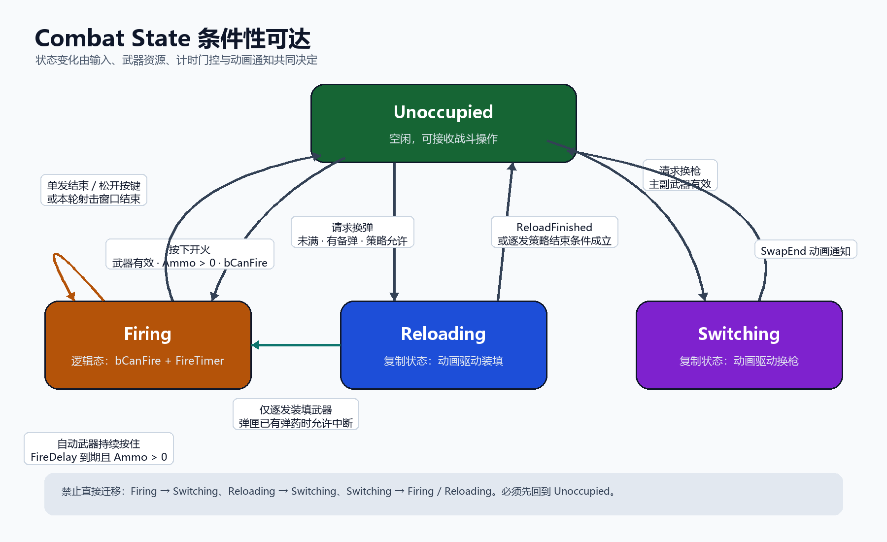

# 换弹系统：Strategy、动画通知与战斗状态机

## 功能点介绍

换弹系统以服务器权威状态为核心，通过 Strategy 区分不同武器的装填规则，再由动画 Strategy 选择对应的蒙太奇和动画段落。弹药不会在玩家按键时立即修改，而是在动画抵达真实装填时刻后，由动画通知反向调用战斗组件，最后由服务器修改弹匣与备弹并复制到客户端。

本单元包含：

- 客户端换弹请求与可靠 Server RPC。
- `CombatState` 对换弹、射击和换枪操作的互斥管理。
- 一次性装填、逐发装填和持续充能三种 Strategy。
- 根据武器和动作选择蒙太奇的动画 Strategy。
- 动画通知如何反向确认换弹完成或单发装填完成。
- `AmountToReload` 的计算方式。
- 服务器更新弹匣、备弹并刷新客户端 HUD 的完整链路。
- 霰弹枪逐发装填和结束条件。
- `Switching` 状态及动画驱动的武器挂点切换。
- `Unoccupied`、`Firing`、`Reloading`、`Switching` 的条件性可达关系。

弹匣耗尽后的自动换弹，以及换弹完成后按住开火立即射击，归入开火与手感优化单元，不在本单元展开。

## 系统职责划分

整个系统可以拆成五个相互配合的职责：

```text
角色输入
└─ 发起 Reload / Switch 请求
        ↓
CombatComponent
├─ 维护权威 CombatState
├─ 校验当前操作是否可进入
├─ 保存当前武器、弹匣与备弹上下文
└─ 调用当前武器对应的 Strategy
        ↓
Reload Strategy
├─ 决定装填方式
├─ 处理动画通知
├─ 计算本次资源变化
└─ 判断何时结束
        ↓
Weapon Animation Strategy
├─ 选择 Montage
├─ 选择 Section
└─ 把动画事件映射回战斗行为
        ↓
服务器复制
├─ CombatState
├─ Weapon::Ammo
└─ CarriedAmmo（OwnerOnly）
        ↓
客户端动画与 HUD
```

`CombatComponent` 是上下文和流程协调者，但不同武器如何装填、每次增加多少弹药、何时结束，不再全部堆积在同一个流程分支中，而是交给对应 Strategy。

## Reload Strategy

### Strategy 的统一职责

换弹 Strategy 面向统一的装填上下文工作。上下文提供：

- 当前角色和装备武器。
- 当前弹匣数量与弹匣容量。
- 当前武器类型的备弹数量。
- 当前 `CombatState`。
- 播放动画、修改弹药、刷新 HUD 和结束状态的受控入口。

每个 Strategy 负责回答四类问题：

```text
CanStartReload
└─ 当前武器和资源是否允许进入 Reloading

BeginReload
└─ 进入状态后应播放什么流程

HandleAnimationEvent
└─ 收到 ReloadFinished、Shell 或 ChargeTick 时如何处理

ShouldFinish / FinishReload
└─ 是否应结束装填并返回 Unoccupied
```

网络权限仍由 `CombatComponent` 控制。Strategy 只描述规则，真正的弹药变化只在服务器执行，避免客户端通过伪造动画通知自行增加弹药。

### 一次性装填 Strategy

一次性装填适用于突击步枪、手枪、狙击步枪和火箭发射器等整匣或一次完成装填的武器。

它的特点是：

- 进入 `Reloading` 后只播放一次完整换弹动画。
- 动画中的 `ReloadFinished` 是唯一提交点。
- 提交时一次性计算 `AmountToReload`。
- 弹匣增加 `AmountToReload`，对应类型的备弹减少相同数量。
- 修改完成后返回 `Unoccupied`。

```text
BeginReload
└─ 播放换弹动画
        ↓
ReloadFinished
└─ AmountToReload
   ├─ CarriedAmmo -= AmountToReload
   ├─ Weapon::Ammo += AmountToReload
   └─ CombatState = Unoccupied
```

### 单发装填 Strategy

单发装填适用于霰弹枪。它不会等待整个动画结束后一次性填满，而是将每个 `Shell` 动画通知视为一次独立、可验证的装填提交。

每次 `Shell` 通知到达服务器后：

```text
确认仍处于 Reloading
确认当前武器使用单发装填 Strategy
确认备弹 > 0 且弹匣未满
        ↓
备弹 -1
弹匣 +1
        ↓
弹匣已满或备弹归零？
├─ 否：继续等待下一次 Shell
└─ 是：跳转 ShotgunEnd
```

这种 Strategy 允许动画、声音和弹药变化逐发对应，也为“装入一部分后中断换弹”提供了状态基础。

### 持续充能 Strategy

持续充能 Strategy 为后续能量武器、蓄能武器或需要持续补充资源的装备预留。它与传统弹匣的区别是：资源不一定在单个动画通知中一次提交，也不一定以整数子弹为单位。

其生命周期可以表达为：

```text
BeginCharge
└─ 进入 Reloading / Charging 表现

ChargeTick 或动画曲线
└─ 持续累计能量，但不超过容量上限

CommitCharge
└─ 服务器提交权威能量值

Cancel / Finish
└─ 根据松开输入、充满或状态中断结束
```

持续充能复用相同的状态入口、服务器权限与 HUD 更新接口，只替换资源累计规则，因此不需要把未来武器的特殊分支继续写入 `CombatComponent`。

### Strategy 带来的扩展关系

| Strategy | 资源提交时机 | 每次提交量 | 结束条件 | 典型武器 |
| --- | --- | ---: | --- | --- |
| 一次性装填 | `ReloadFinished` | `AmountToReload` | 一次提交后结束 | 步枪、手枪、狙击枪、火箭发射器 |
| 单发装填 | 每个 `Shell` | 1 | 弹匣满、备弹为零或允许的中断 | 霰弹枪 |
| 持续充能 | `ChargeTick`、动画曲线或固定时间步 | 连续值或离散能量单位 | 充满、松开或被状态中断 | 后续能量武器 |

## 武器动画 Strategy

装填规则与动画选择是两个独立变化维度：

- Reload Strategy 决定“弹药怎样变化”。
- Weapon Animation Strategy 决定“角色和武器怎样表现”。

动画 Strategy 根据动作类型、武器类型、装填方式和瞄准状态返回对应的 Montage 与 Section。例如：

| 动作 | 条件 | Montage / Section |
| --- | --- | --- |
| 一次性换弹 | 步枪、手枪、狙击枪、火箭发射器 | `ReloadMontage / Rifle` |
| 单发换弹 | 霰弹枪 | `ReloadMontage / Shotgun` |
| 单发换弹结束 | 弹匣满或备弹为零 | `ReloadMontage / ShotgunEnd` |
| 换枪 | 主副武器同时存在 | `SwitchMontage` |
| 腰射 | 未瞄准 | `FireWeaponMontage / RifleHip` |
| 瞄准射击 | 正在瞄准 | `FireWeaponMontage / RifleAim` |

这样可以避免在角色类的多个播放函数中重复维护武器类型 `switch`。新增武器时，可以复用现有装填 Strategy，只提供不同动画 Strategy；也可以复用现有动画，只替换资源变化 Strategy。

例如一把使用步枪换弹动作的能量武器，可以组合：

```text
ContinuousChargeReloadStrategy
        +
RifleAnimationStrategy
```

Strategy 组合让玩法规则与美术表现彼此解耦。

## 普通武器完整换弹流程

### 1. 玩家发起换弹

角色输入调用：

```text
ABlasterCharacter::ReloadButtonPressed
└─ UCombatComponent::Reload
   └─ ServerReload [Reliable Server RPC]
```

客户端首先进行快速条件检查：

- 存在已装备武器。
- 当前弹匣未满。
- 当前武器类型仍有备弹。
- 当前没有处于换弹状态。

本地检查用于减少无效 RPC，但不能代替服务器校验。

相关实现：

- `Source/Blaster/Character/BlasterCharacter.cpp:563`
- `Source/Blaster/BlasterComponent/CombatComponent.cpp:472`

### 2. 服务器重新校验

`ServerReload_Implementation()` 在服务器重新检查：

- 角色和武器仍然有效。
- 当前状态必须是 `ECS_Unoccupied`。
- 弹匣没有装满。
- 备弹数量大于零。

服务器校验通过后设置：

```cpp
CombatState = ECombatState::ECS_Reloading;
```

服务器是状态迁移的唯一权威端。客户端无法直接把自己切换到 `Reloading`，也不能仅凭本地动画修改弹药。

相关实现：

- `Source/Blaster/BlasterComponent/CombatComponent.cpp:483`

### 3. 复制状态并播放动画

服务器设置 `CombatState` 后立即播放自己的换弹动画。其他客户端收到复制值时，通过 `OnRep_CombatState()` 执行同样的动画入口：

```text
ServerReload
├─ CombatState = Reloading
└─ HandleReload
   └─ Animation Strategy 选择 Montage / Section

客户端收到 CombatState
└─ OnRep_CombatState
   └─ HandleReload
      └─ 播放对应换弹动画
```

相关实现：

- `Source/Blaster/BlasterComponent/CombatComponent.cpp:539`
- `Source/Blaster/BlasterComponent/CombatComponent.cpp:561`
- `Source/Blaster/Character/BlasterCharacter.cpp:911`

### 4. 动画反向确认换弹时机

普通武器的换弹动画在弹匣真正完成替换的位置放置 `ReloadFinished` 通知。动画蓝图收到该通知后，调用暴露为 `BlueprintCallable` 的 `FinishReloading()`。

```text
动画播放到 ReloadFinished
        ↓
Animation Blueprint
        ↓
CombatComponent::FinishReloading
        ↓
仅服务器提交弹药变化
```

动画通知负责时间点，服务器负责结果。即使客户端本地也播放动画并触发通知，`HasAuthority()` 仍会阻止客户端自行增加弹药。

相关实现：

- `Source/Blaster/BlasterComponent/CombatComponent.h:43`
- `Source/Blaster/BlasterComponent/CombatComponent.cpp:502`

## `AmountToReload` 计算

一次性装填 Strategy 在动画完成时计算：

```text
RoomInMag = MagCapacity - CurrentAmmo
AmountCarried = 当前武器类型的备弹
AmountToReload = Min(RoomInMag, AmountCarried)
```

当前代码使用：

```cpp
int32 Least = FMath::Min(RoomInMag, AmountCarried);
return FMath::Clamp(RoomInMag, 0, Least);
```

在弹药数据保持非负的前提下，其结果等价于 `Min(RoomInMag, AmountCarried)`。

示例一：

```text
弹匣容量 = 30
当前弹药 = 12
备弹 = 50

RoomInMag = 18
AmountToReload = Min(18, 50) = 18
```

示例二：

```text
弹匣容量 = 30
当前弹药 = 12
备弹 = 7

RoomInMag = 18
AmountToReload = Min(18, 7) = 7
```

相关实现：

- `Source/Blaster/BlasterComponent/CombatComponent.cpp:585`

## 服务器更新弹匣与备弹

`UpdateAmmoValues()` 只提交服务器计算结果：

```text
ReloadAmount = AmountToReload()
        ↓
CarriedAmmoMap[WeaponType] -= ReloadAmount
        ↓
CarriedAmmo = 当前武器类型的新备弹
        ↓
Weapon::AddAmmo(ReloadAmount)
```

这里存在两种弹药数据：

- `CarriedAmmoMap`：服务器保存的全部武器类型备弹表。
- `CarriedAmmo`：当前装备武器的备弹缓存，只复制给拥有者。

`AWeapon::AddAmmo()` 具有服务器权限检查，并把弹匣值限制在 `0` 到 `MagCapacity` 之间。

相关实现：

- `Source/Blaster/BlasterComponent/CombatComponent.cpp:567`
- `Source/Blaster/Weapon/Weapon.cpp:234`

## HUD 更新完整链路

服务器更新换弹结果后，弹匣和备弹分别通过自己的复制链更新 HUD。

### 备弹

```text
服务器 CarriedAmmoMap
└─ 更新当前 CarriedAmmo
   └─ CarriedAmmo 使用 COND_OwnerOnly 复制
      └─ 客户端 OnRep_CarriedAmmo
         └─ PlayerController::SetHUDCarriedAmmo
            └─ HUD 显示 /备弹
```

### 弹匣

```text
服务器 Weapon::AddAmmo
└─ 修改复制属性 Weapon::Ammo
   └─ 客户端 OnRep_Ammo
      └─ Weapon::SetHUDAmmo
         └─ PlayerController::SetHUDWeaponAmmo
            └─ HUD 显示 Ammo 弹匣数量
```

弹匣和备弹是两个独立复制属性，客户端不依赖本地增量推算，而是以服务器复制的绝对值为最终结果。

相关实现：

- `Source/Blaster/BlasterComponent/CombatComponent.cpp:32`
- `Source/Blaster/BlasterComponent/CombatComponent.cpp:454`
- `Source/Blaster/Weapon/Weapon.cpp:117`
- `Source/Blaster/PlayerController/BlasterPlayerController.cpp:148`
- `Source/Blaster/PlayerController/BlasterPlayerController.cpp:166`

## 霰弹枪逐发装填

霰弹枪的 `FinishReloading()` 不执行普通武器的批量装填。它依赖动画中的多个 `Shell` 通知逐发提交：

```text
进入 Shotgun Section
        ↓
Shell Notify
        ↓
ShotgunShellReload
        ↓
服务器权限与状态校验
        ↓
UpdateShotgunAmmoValues
├─ CarriedAmmo -= 1
├─ Weapon::Ammo += 1
└─ 判断是否进入 ShotgunEnd
```

`ShotgunShellReload()` 同时检查：

- 当前实例必须具有服务器权限。
- `CombatState` 必须仍为 `ECS_Reloading`。
- 当前武器必须是霰弹枪。

当弹匣装满或备弹归零时，服务器执行 `Montage_JumpToSection("ShotgunEnd")`。客户端收到备弹归零或弹匣已满的复制结果后，也会跳转到相同结束段，避免继续播放无效的插弹动作。

相关实现：

- `Source/Blaster/BlasterComponent/CombatComponent.cpp:599`
- `Source/Blaster/BlasterComponent/CombatComponent.cpp:648`
- `Source/Blaster/BlasterComponent/CombatComponent.cpp:658`

### 客户端看似一次增加两发的原因

当前 C++ 中，每次有效 `Shell` 回调只会在服务器执行 `AddAmmo(1)`，不存在客户端本地增加一次、再被服务器复制增加一次的路径。

实际 `Reload` 蒙太奇的霰弹枪段中存在四个独立的 `Shell` 通知，时间约为：

```text
4.0235
4.5217
5.0258
5.5299
```

服务器会按照通知次数逐次增加弹药。如果两个服务器结果在客户端同一次界面刷新中被观察到，HUD 可能从 `2` 直接显示为 `4`，表现为一次增加两发。问题的检查重点因此是：每个可见插弹动作是否严格对应一个 `Shell` 通知，以及客户端是否跳过了中间的服务器复制值。

## Switching 状态

换枪不是立即修改挂点的普通函数调用，而是一个由服务器状态和动画通知共同管理的过程。

### 进入条件

玩家发起换枪后调用可靠 Server RPC。服务器只有在以下条件满足时才允许执行：

- 主武器存在。
- 副武器存在。
- 当前 `CombatState` 为 `ECS_Unoccupied`。

```text
SwitchButtonPressed
└─ ServerSwitchButtonPressed
   └─ ShouldSwapWeapons
      └─ CombatState == Unoccupied
         └─ SwapWeapons
```

服务器播放 `SwitchMontage`，将状态设置为 `ECS_Switching`，并交换主副武器引用。客户端收到 `CombatState` 后，通过 `OnRep_CombatState()` 播放对应换枪动画。

相关实现：

- `Source/Blaster/Character/BlasterCharacter.cpp:423`
- `Source/Blaster/Character/BlasterCharacter.cpp:432`
- `Source/Blaster/BlasterComponent/CombatComponent.cpp:764`

### 动画通知修改挂点

换枪动画到达手部交换时刻后调用 `SwapAttachment()`：

```text
新的主武器
├─ WeaponState = Equipped
├─ 附加到 RightHandSocket
├─ 更新弹匣 HUD
└─ 更新当前武器备弹 HUD

原主武器
├─ WeaponState = EquippedSecondary
└─ 附加到 BackpackSocket
```

动画播放结束后调用 `SwapEnd()`，服务器把状态恢复为 `ECS_Unoccupied`。

这种实现保证了模型挂点变化发生在动画中手部真正接触武器的时刻，而不是按键瞬间跳变。

相关实现：

- `Source/Blaster/BlasterComponent/CombatComponent.cpp:519`
- `Source/Blaster/BlasterComponent/CombatComponent.cpp:527`

## CombatState 条件性可达



图中的 `Firing` 是由 `bCanFire`、`FireTimer` 和武器 `FireDelay` 共同表达的短生命周期逻辑状态；`Reloading` 与 `Switching` 则是需要复制给其他客户端的持续状态。

### 状态职责

| 状态 | 含义 | 允许的主要入口 |
| --- | --- | --- |
| `Unoccupied` | 没有互斥战斗动作正在执行 | 可尝试射击、换弹、换枪 |
| `Firing` | 当前射击窗口，受射速计时器门控 | 只能由满足条件的开火请求进入 |
| `Reloading` | 正在执行装填 Strategy | 只能从 `Unoccupied` 发起；逐发装填武器可按规则中断 |
| `Switching` | 正在执行换枪动画 | 只能从 `Unoccupied` 且主副武器有效时进入 |

### 可达条件

#### `Unoccupied → Firing`

必须同时满足：

- 当前武器有效。
- 弹匣不为空。
- `bCanFire == true`。
- 当前没有换弹或换枪行为占用状态。

#### `Firing → Firing`

只有自动武器允许连续迁移：

- 玩家仍然按住开火。
- `bAutomatic == true`。
- `FireDelay` 已结束并重新打开 `bCanFire`。
- 弹匣仍有弹药。

#### `Unoccupied → Reloading`

必须满足：

- 当前武器有效。
- 弹匣未满。
- 当前武器类型有备弹或有可用充能资源。
- 当前 Reload Strategy 允许进入。

#### `Reloading → Unoccupied`

由 Strategy 对应的结束事件触发：

- 一次性装填收到 `ReloadFinished`。
- 单发装填弹匣已满或备弹归零并进入 `ShotgunEnd`。
- 持续充能达到容量上限、主动结束或被合法取消。

#### `Reloading → Firing`

只有支持换弹中断的单发装填武器允许直接到达，并且弹匣中已经至少有一发可用弹药。其他装填 Strategy 必须先回到 `Unoccupied`。

#### `Unoccupied → Switching`

必须满足：

- 主武器和副武器均有效。
- 当前没有换弹、射击窗口或其他互斥动作。

#### `Switching → Unoccupied`

只能由换枪动画结束通知 `SwapEnd` 完成。`Switching` 期间不能直接进入射击或换弹，必须先返回 `Unoccupied`。

## CombatState 与 WeaponState 的区别

`CombatState` 描述角色当前正在进行的战斗动作；`EWeaponState` 描述某一把武器当前在角色和场景中的归属状态。两套状态彼此关联，但不能混为一套状态机。

| WeaponState | 含义 | 条件性可达 |
| --- | --- | --- |
| `EWS_Equipped` | 当前主武器，附加在右手 | 拾取为主武器，或换枪动画执行 `SwapAttachment` |
| `EWS_EquippedSecondary` | 当前副武器，附加在背包 | 拾取为副武器，或原主武器在换枪时转为副武器 |
| `EWS_Dropped` | 脱离角色并作为场景武器存在 | 主动丢弃或角色生命周期要求丢弃普通武器 |

换枪过程中，只有 `CombatState == Switching` 且动画到达 `SwapAttachment` 时，才允许主副武器在 `Equipped` 与 `EquippedSecondary` 之间互换。这样可以避免角色状态已经开始换枪，但武器模型仍提前出现在错误挂点。

相关实现：

- `Source/Blaster/BlasterTypes/CombatState.h:4`
- `Source/Blaster/Weapon/Weapon.h:10`
- `Source/Blaster/Weapon/Weapon.cpp:88`

## 技术亮点

### 装填规则与动画表现双 Strategy 解耦

Reload Strategy 管理资源规则，Weapon Animation Strategy 管理 Montage 和 Section。新增武器可以分别复用已有玩法逻辑与动画表现，避免形成不断扩大的武器类型分支。

### 动画通知作为权威提交时机

换弹和换枪都不是按键后立即完成。`ReloadFinished`、`Shell`、`SwapAttachment` 与 `SwapEnd` 将动画中的关键帧反向映射到战斗逻辑，使弹药变化、武器挂点和角色动作保持一致。

### 服务器权威资源更新

客户端只能发起换弹或换枪请求。服务器校验状态、执行 Strategy、修改弹匣与备弹，再把绝对值复制给客户端，降低客户端维护负担并避免本地伪造弹药。

### 条件性可达避免动作冲突

换弹和换枪只能从 `Unoccupied` 进入；`Switching` 不能直接转入开火或换弹；单发装填到射击的直接迁移则由武器 Strategy 明确授权。状态机将“哪些动作能够打断哪些动作”从零散判断提升为可验证的规则。

### 为持续充能武器预留扩展点

持续充能只需要提供新的资源累计 Strategy 和相应动画 Strategy，仍然复用服务器权限、状态复制、动画事件及 HUD 管线，不需要改变普通弹匣和霰弹枪的现有实现。

## 单元总结

换弹系统由服务器权威状态机、Reload Strategy、Weapon Animation Strategy 和动画通知共同组成。一次性装填武器在 `ReloadFinished` 时计算 `AmountToReload` 并整体提交；霰弹枪在每个 `Shell` 通知中逐发提交；持续充能 Strategy 则为未来能量武器保留持续累计和中断能力。

服务器负责校验请求、更新 `CombatState`、弹匣与备弹，客户端通过状态复制播放动画，并通过 `OnRep_Ammo` 与 `OnRep_CarriedAmmo` 刷新 HUD。`Switching` 状态同样由服务器控制，并使用 `SwapAttachment` 和 `SwapEnd` 两个动画时机完成挂点切换与状态复位。最终，`Unoccupied`、逻辑 `Firing`、`Reloading` 与 `Switching` 形成具有明确入口条件和禁止迁移关系的战斗状态机。
